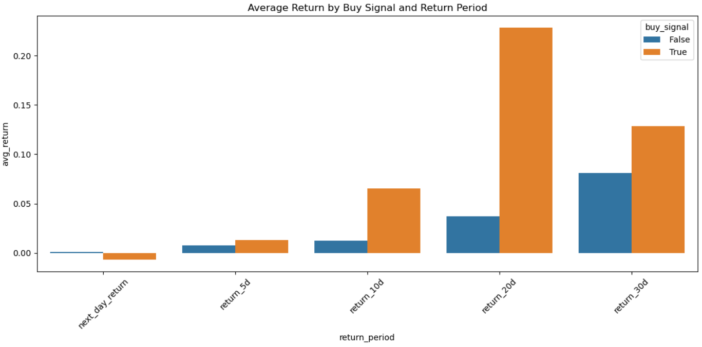
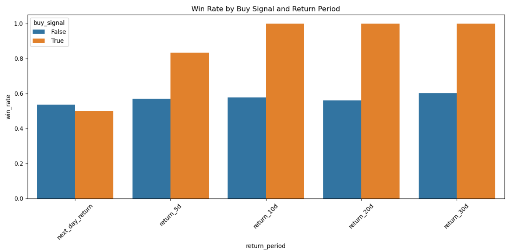

# Kafka Stock Market Pipeline

## Overview

This project implements a daily stock market data pipeline using:

- **Kafka** for streaming stock data from producer to consumer
- **Airflow** to orchestrate the end-to-end workflow
- **PostgreSQL** as the data warehouse for stock data and indicators
- **Alpha Vantage API** for fetching daily stock prices
- **Email notifications** to send daily stock analysis reports

---

## Architecture

1. **Producer**: Fetches daily stock data for a list of symbols from Alpha Vantage and publishes to a Kafka topic.
2. **Consumer**: Reads stock data from Kafka, stores it in PostgreSQL, and computes technical indicators (SMA, RSI, MACD, buy signals).
3. **Airflow DAG**: Orchestrates running producer, consumer, fetching results, and emailing reports.
4. **Email**: Sends a daily report with stock data and computed signals.
5. **Jupyter Notebook**: Analyzes historical stock prices after both buy_signal is marked True and False, to determine effectiveness of the assigned signals.

---

## Setup Instructions

### 1. Clone the repo

```bash
git clone <your-repo-url>
cd kafka-stock-market-pipeline
```

### 2. Install dependencies

Make sure you have Python 3.8+ installed.

```bash
pip install -r requirements.txt
```
(Requirements include kafka-python, psycopg2-binary, pandas, apache-airflow, etc.)

### 3. Setup Kafka

- Install Kafka locally or on EC2 instance

- Create Kafka topic stock_data

### 4. Setup PostgreSQL

- Create database stock_market_av

- Run the provided SQL schema to create tables

### 5. Configure Alpha Vantage API Key

- Get free API key from Alpha Vantage

- Set your API key in producer.py or use environment variables

### 6. Configure Airflow

- Initialize Airflow DB: airflow db init

- Place DAG file in Airflow’s dags folder

- Start Airflow scheduler and webserver

## Running the Pipeline
- Trigger the DAG kafka_stock_pipeline manually via Airflow UI or schedule daily

DAG runs:

- Kafka producer fetches stock data

- Kafka consumer stores data and computes indicators

- Results fetched from PostgreSQL and saved as CSV

- Email with report sent automatically

## Data and Indicators
Stocks: Example symbols include MSFT, TSLA, NVDA

Indicators computed:

- SMA 10-day and 50-day

- RSI (Relative Strength Index)

- MACD (Moving Average Convergence Divergence)

- Buy signal based on combined indicator logic

## Quick Analysis Summary
We include a Jupyter Notebook visualization of:

- Buy signal performance across multiple return horizons (1, 5, 10, 20, 30 days)

Metrics:

- Average return

- Median return

- Win rate (percentage of positive returns)

Note: Sample sizes are currently small and results are preliminary. Data volume will grow over time as the pipeline runs daily.

## Future Enhancements
- Expand stock universe beyond initial symbols

- Improve buy signal logic and backtesting

- Add visual dashboards for ongoing performance

- Deploy with containerization (Docker + Kubernetes)

- Optimize Airflow DAG for parallelism and retries

## How to Contribute
- Fork the repo and create feature branches

- Test thoroughly before submitting PRs

- Open issues for bugs or enhancement requests

## License
MIT License © Charlie Rowe

## Contact
Questions? Email: cwr321@example.com
GitHub: crowe32996

## Screenshots

### ✅ Kafka for Streaming Data from Alpha Vantage API
Streaming stock values from Alpha Vantage API and calculating indicators:


---

### ✅ Postgres for Structuring and Storing Stock Data
Organizing streamed stock data for each stock each day, storing indicators and potential buy signals:


---

### ✅ Jupyter Notebook Summary
Analyzing buy signal performance by average return and win rate, across multiple return timelines:



---

### ✅ Airflow DAG Graph View
This shows a successful run of the end-to-end pipeline:


---

### ✅ Jupyter Notebook Summary
Analyzing buy signal performance by average return and win rate, across multiple return timelines:


---

### ✅ Sample Email Output
Example of emailed resulting stock data with computed indicators:


## Notes
This project runs on an AWS EC2 instance with multiple services (Kafka, PostgreSQL, Airflow). It requires coordination and setup, but provides a solid example of a production-like stock data pipeline.
