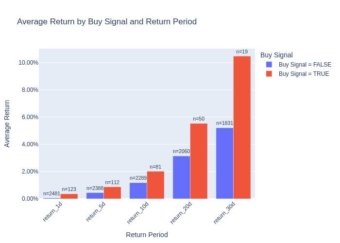
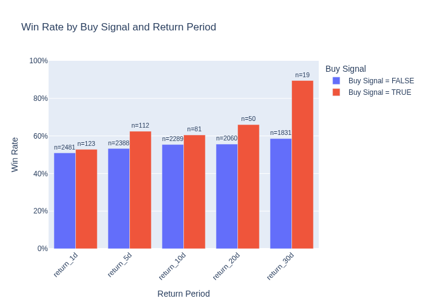

# Stock Technical Indicator Analysis

## Overview

This project is a data pipeline that generates automated buy signal alerts for selected stocks and evaluates the effectiveness of technical indicators in predicting future performance. 

A buy signal is triggered when all of the following conditions are met:
- MACD > Signal line: The Moving Average Convergence/Divergence line (difference between the 12-day and 26-day Exponential Moving Averages/EMA) is above its 9-day EMA signal line, indicating positive momentum.

- RSI < 65: The Relative Strength Index is below 65, meaning the stock is not yet overbought and has room to grow.

- 10-day SMA > 50-day SMA: The 10-day Simple Moving Average is above the longer-term 50-day SMA, indicating an upward trend.

- Closing price > 10-day SMA: The current closing price is above the 10-day SMA, showing strength and confirming the recent positive momentum.

This version tracks three stocks (NVDA, MSFT, TSLA) to stay within free API limits, but future iterations will include a larger population of stock symbols, to get a larger sample size in determining the effectiveness in these indicators in predicting future success.


---

## Stock Buy Signal Average Returns
Early results show that buy signals are effective in realizing stronger average returns, particularly over 5+ day horizons.

---

## Architecture

1. **Dockerized Environment**: The entire stack (Airflow, Kafka, PostgreSQL, and pipeline scripts) runs inside Docker containers using Docker Compose for easy, consistent setup.
2. **Kafka Producer**: Fetches daily stock data for a list of symbols from Alpha Vantage and publishes to a Kafka topic.
3. **Kafka Consumer**: Reads stock data from Kafka, stores it in PostgreSQL, and computes technical indicators (SMA, RSI, MACD, buy signals).
4. **PostgreSQL Database**: Stores raw stock data and calculated indicators for analysis and reporting.
5. **Airflow DAG**: Orchestrates running the producer, consumer, fetching results, running buy signnal effectiveness analysis, and emailing reports and visuals.
6. **Email Notification**: Sends a daily report with stock data and computed signals.

---
## Screenshots

### Kafka for Streaming Data from Alpha Vantage API
Streaming/producing stock values from Alpha Vantage API:


Consuming stock data and calculating indicators:


---

### Postgres for Structuring and Storing Stock Data
Organizing streamed stock data for each stock each day, storing indicators and potential buy signals:


---

### Airflow DAG Graph View
This shows a successful run of the end-to-end pipeline:


---

### Buy Signal Analysis
Analyzing buy signal performance by average return (shown at the top) and win rate, across multiple return timelines:


---

### Sample Email Output
Example of emailed resulting stock data with computed indicators:


## Setup Instructions

### 1. Clone the repo

```bash
git clone https://github.com/crowe32996/stock-market-buy-signals
cd stock-market-buy-signals
```

### 2. Configure Alpha Vantage API Key

- Get a free API key from Alpha Vantage

- Open dags/scripts/producer.py and replace the API_KEY value.


### 3. Build and start the Docker containers

This will:
- Start Kafka, Postgres, and Airflow (webserver + scheduler)

- Automatically create the stock_market_av database and stock_data table schema

```bash
docker-compose up -d --build
```

### 4. Initialize Airflow (First Time Only)

Replace the following with your chosen credentials:

```bash
docker-compose run airflow-webserver db init

docker-compose run airflow-webserver users create --username admin --password admin --firstname Charlie --lastname Rowe --role Admin --email cwr321@gmail.com
```

### 5. Access the Airflow UI
Open your browser and go to http://localhost:8080, then log in with your new user credentials.

Trigger the DAG kafka_stock_pipeline. Each run will:
- Run the Kafka producer to fetch daily stock data

- Process and store the data in Postgres

- Generate indicators + buy signal

- Save results to CSV

- Email the stock summary (Update recipient email in dags/kafka_stock_dag.py)

## Data and Indicators
Stocks: Example symbols include MSFT, TSLA, NVDA

Indicators computed:

- SMA 10-day and 50-day

- RSI (Relative Strength Index)

- MACD (Moving Average Convergence Divergence)

- Buy signal based on combined indicator logic

## Quick Analysis Summary
Included is a Python visualization of:

- Buy signal performance across multiple return horizons (1, 5, 10, 20, 30 days)

Metrics:

- Average return

- Win rate (percentage of positive returns)

Note: Sample sizes are currently small and results are preliminary. Data volume will grow over time as the pipeline runs daily.

## Future Enhancements
- Expand stock universe beyond initial symbols

- Improve buy signal logic and introduce multiple methodologies for comparison

- Add visual dashboards for live tracking of buy signal effectiveness

- Deploy Docker-based pipeline onto Kubernetes


## License
MIT License © Charlie Rowe

## Contact
Questions? Email: cwr321@gmail.com
GitHub: crowe32996


