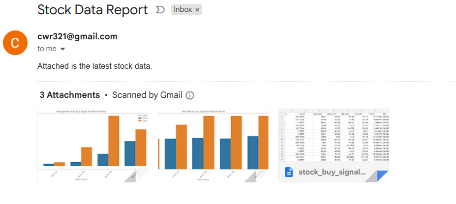

# Kafka Stock Market Pipeline

## Overview

This project is a production-style pipeline that generates automated buy signal alerts for selected stocks and evaluates the effectiveness of technical indicators in predicting future performance. 

A buy signal is triggered when all of the following conditions are met:
- MACD > Signal line: The MACD line (difference between the 12-day and 26-day EMAs) is above its 9-day EMA signal line, indicating positive momentum.

- RSI < 65: The Relative Strength Index is below 65, meaning the stock is not yet overbought and has room to grow.

- 10-day SMA > 50-day SMA: The short-term trend (10-day Simple Moving Average) is above the longer-term trend (50-day SMA), indicating an upward trend.

- Closing price > 10-day SMA: The current closing price is above the 10-day SMA, showing strength and confirming the recent positive momentum.

The stock results are analyzed in buy_signal_result_analysis.ipynb, comparing how the stocks trended over different time horizons after the buy_signal field was marked "True" or "False". This use case looks specifically at three stocks (NVDA, MSFT, TSLA) to manage API request limits, but future iterations will include a larger number of stocks.

---

## Stock Buy Signal Average Returns
Early results show a sign of buy signals leading to larger average returns, for the 5-day time horizon and beyond:

---

## Architecture

1. **EC2 Instance**: Hosts all services — Kafka, Airflow, PostgreSQL, and pipeline scripts — for a production-like cloud environment.
2. **Kafka Producer**: Fetches daily stock data for a list of symbols from Alpha Vantage and publishes to a Kafka topic.
3. **Kafka Consumer**: Reads stock data from Kafka, stores it in PostgreSQL, and computes technical indicators (SMA, RSI, MACD, buy signals).
4. **PostgreSQL Database**: Stores raw stock data and calculated indicators for analysis and reporting.
5. **Airflow DAG**: Orchestrates running producer, consumer, fetching results, and emailing reports.
6. **Email Notification**: Sends a daily report with stock data and computed signals.
7. **Jupyter Notebook**: Analyzes historical stock prices after both buy_signal is marked True and False, to determine effectiveness of the assigned signals.

---
## Screenshots

### ✅ Kafka for Streaming Data from Alpha Vantage API
Streaming/producing stock values from Alpha Vantage API:


Consuming stock data and calculating indicators:


---

### ✅ Postgres for Structuring and Storing Stock Data
Organizing streamed stock data for each stock each day, storing indicators and potential buy signals:


---

### ✅ Airflow DAG Graph View
This shows a successful run of the end-to-end pipeline:


---

### ✅ Jupyter Notebook Analysis
Analyzing buy signal performance by average return (shown at the top) and win rate, across multiple return timelines:


---

### ✅ Sample Email Output
Example of emailed resulting stock data with computed indicators:


## Setup Instructions

### 1. Clone the repo

```bash
git clone https://github.com/crowe32996/stock-market-buy-signals
cd stock-market-buy-signals
```

### 2. Install dependencies

Make sure you have Python 3.8+ installed.

```bash
pip install -r requirements.txt
```
(Requirements include kafka-python, psycopg2-binary, pandas, apache-airflow, etc.)

### 3. Setup Kafka

- Install Kafka locally or on EC2 instance

- Create Kafka topic stock_data

### 4. Setup PostgreSQL

- Create database stock_market_av

- Run the provided SQL schema to create tables

### 5. Configure Alpha Vantage API Key

- Get free API key from Alpha Vantage

- Set your API key in producer.py or use environment variables

### 6. Configure Airflow

- Initialize Airflow DB: airflow db init

- Place DAG file in Airflow’s dags folder

- Start Airflow scheduler and webserver

## Running the Pipeline
- Trigger the DAG kafka_stock_pipeline manually via Airflow UI or schedule daily

DAG runs:

- Kafka producer fetches stock data

- Kafka consumer stores data and computes indicators

- Results fetched from PostgreSQL and saved as CSV

- Email with report sent automatically

## Data and Indicators
Stocks: Example symbols include MSFT, TSLA, NVDA

Indicators computed:

- SMA 10-day and 50-day

- RSI (Relative Strength Index)

- MACD (Moving Average Convergence Divergence)

- Buy signal based on combined indicator logic

## Quick Analysis Summary
Included is a Jupyter Notebook visualization of:

- Buy signal performance across multiple return horizons (1, 5, 10, 20, 30 days)

Metrics:

- Average return

- Median return

- Win rate (percentage of positive returns)

Note: Sample sizes are currently small and results are preliminary. Data volume will grow over time as the pipeline runs daily.

## Future Enhancements
- Expand stock universe beyond initial symbols

- Improve buy signal logic and backtesting

- Add visual dashboards for ongoing performance

- Deploy with containerization (Docker + Kubernetes)

- Optimize Airflow DAG for parallelism and retries

## How to Contribute
- Fork the repo and create feature branches

- Test thoroughly before submitting PRs

- Open issues for bugs or enhancement requests

## License
MIT License © Charlie Rowe

## Contact
Questions? Email: cwr321@gmail.com
GitHub: crowe32996


