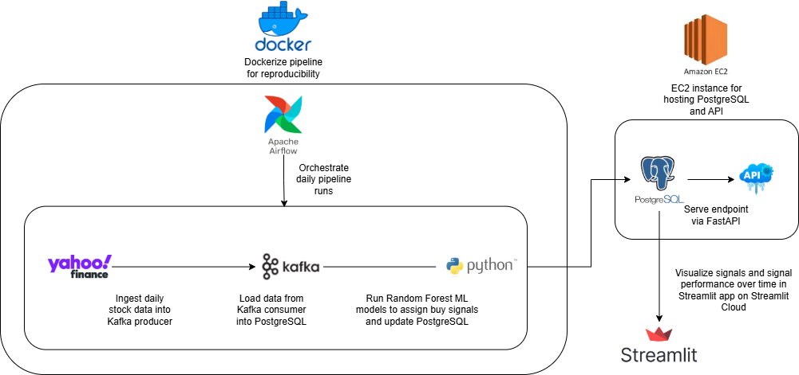
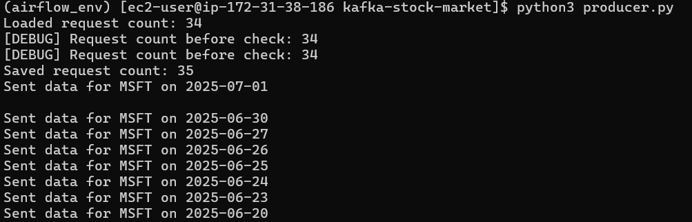
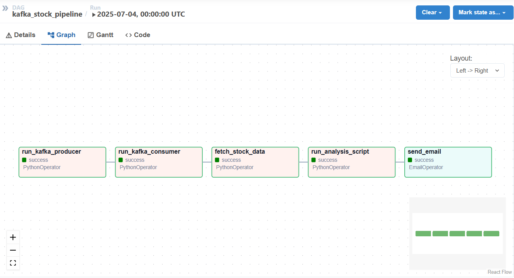

# Stock Technical Indicator Analysis

## Overview

Explore ML-based stock buy signals interactively in the Streamlit app:


[Open Streamlit App](https://stock-market-buy-signals-ftwnfk6lg32nxd7tcfyjpk.streamlit.app)

This project is a data pipeline that generates automated buy signal alerts for selected stocks and evaluates the effectiveness of technical indicators in predicting future performance. 

---

## Stock Buy Signal Average Return
In out-of-sample data from 2024-present, the average return % is greater for those with buy signals than hold and sell, as well as S&P 500 (SPY). 
Specifically for the long horizon, as of 10/10/2025, the average return over 150 days is 13.8% for those with "buy" signals, compared to 7.2% for SPY and "hold" signals, and -0.5% for those with "sell" signals.
See streamlit link for more up-to-date, interactive visuals across all horizons and win rates. 


---

## Methodology

### Random Forest Model
A **Random Forest classifier** is used to predict whether a stock will generate a **buy signal** over a given horizon:

- A **Random Forest** is an ensemble of decision trees, each trained on random subsets of features and data.  
- Each tree outputs a prediction (buy / not buy), and the final prediction is the **majority vote** of all trees.  
- Separate models are trained for **short, medium, and long horizons** to create different trading strategies.  
- The model outputs a **probability of a buy signal**, which is then bucketed into buy, hold, or sell categories.

**Advantages:**
- Handles large numbers of features well.  
- Strong in ruling out noisy indicators.  
- Provides probability/confidence levels, not just binary predictions.

### Feature Inputs
The Random Forest model uses a combination of **technical indicators**, **price/volume metrics**, and **momentum/volatility indicators**, calculated separately for each horizon:

- **Price & Volume**: closing price and number of trades.  
- **Simple Moving Averages (SMA)**: short-term (3,5,10), medium (10,20,50), long-term (20,50,100) to capture trends over different horizons.  
- **Exponential Moving Averages (EMA)**: similar to SMA but weights recent prices more heavily.  
- **MACD & Signal Line**: measures momentum from the difference between fast and slow EMAs.  
- **RSI (Relative Strength Index)**: momentum indicator ranging from 0–100; <30 is oversold, >70 is overbought.  
- **Momentum & Volatility Features**: measures of the speed and variability of price changes.

### Buy Signal Definition
Probabilities from the Random Forest classifier are bucketed as:

- **Buy**: top 20% probability  
- **Hold**: middle 60% probability  
- **Sell**: bottom 20% probability

### Model Effectiveness
- The model's signals are evaluated over time and plotted in the **Signal Performance** tab.  
- The evaluation uses **out-of-sample data** to ensure results are not biased by training data.  
- Historical data (e.g., 2021–2023) may show higher returns due to overfitting, so focus on the out-of-sample evaluation for realistic performance.

⚠️ **Disclaimer**  
The information presented is for **educational and informational purposes only** and **does not constitute financial, investment, or trading advice**. Past performance does not guarantee future results.


## Architecture



1. **Dockerized Environment**: The entire stack (Airflow, Kafka, PostgreSQL, and pipeline scripts) runs inside Docker containers using Docker Compose for easy, consistent setup.
2. **Kafka Producer**: Fetches daily stock data for a list of symbols from Yahoo Finance and publishes to a Kafka topic. 
3. **Kafka Consumer**: Reads stock data from Kafka, stores it in PostgreSQL, and computes technical indicators to feed into Random Forest model for signal outputs.
4. **PostgreSQL Database**: Stores raw stock data, calculated indicators, and Random Forest outputs for analysis and reporting.
5. **Airflow DAG**: Orchestrates running the producer, consumer, fetching results, running random forest ML models, and outputting probabilities of "buy" signal.
7. **Streamlit App**: Tracks most recent "Buy", "Hold", and "Sell" signals for each stock, analyzes out-of-sample data signal results from 2024-present, and provides historical data. The app references a CSV output of the PostgreSQL database is deployed on Streamlit Cloud

---
## Screenshots

### Kafka for Streaming Data from Alpha Vantage API
Streaming/producing stock values from Alpha Vantage API:



Consuming stock data and calculating indicators:


---

### Postgres for Structuring and Storing Stock Data
Organizing streamed stock data for each stock each day, storing indicators and potential buy signals:


---

### Airflow DAG Graph View
This shows a successful run of the end-to-end pipeline:


---

### Sample Email Output
Example of emailed resulting stock data with computed indicators:


## Setup Instructions

### 1. Clone the repo

```bash
git clone https://github.com/crowe32996/stock-market-buy-signals
cd stock-market-buy-signals
```


### 2. Build and start the Docker containers

This will:
- Start Kafka, Postgres, and Airflow (webserver + scheduler)

- Automatically create the stock_market_av database and stock_data table schema

```bash
docker-compose up -d --build
```

### 4. Initialize Airflow (First Time Only)

Replace the following with your chosen credentials, and set a password:

```bash
docker-compose run airflow-webserver db init

docker-compose run airflow-webserver users create --username admin --password admin --firstname Charlie --lastname Rowe --role Admin --email cwr321@gmail.com
```

### 5. Configure Airflow Variables (Optional)

The DAG uses an Airflow Variable `run_producer` to control whether the Kafka producer runs on each DAG execution.

- **Variable name:** `run_producer`
- **Type:** String (`true` or `false`)
- **Default behavior:** Automatically set to `"true"`, where the DAG updates the messages produced by Yahoo Finance.

- In the Airflow UI, go to **Admin > Variables**, and create a new variable:
  - Key: `run_producer`
  - Value: `true`

- Or via Docker CLI (replace container name if different):

```bash
docker exec -it stock-market-buy-signals-airflow-webserver-1 airflow variables set run_producer true
```


### 6. Access the Airflow UI
Open your browser and go to http://localhost:8080, then log in with your new user credentials.

Trigger the DAG kafka_stock_pipeline. Each run will:
- Run the Kafka producer to fetch daily stock data

- Process and store the data in Postgres

- Generate indicators + buy signal

- Save results to CSV

- Optionally email the stock summary (Uncomment and recipient email in dags/kafka_stock_dag.py)

### 7. Run the Streamlit App
Once your pipeline is running and the indicators/signals are generated, you can view the interactive Streamlit dashboard:

1. Navigate to the `app` directory:
```bash
cd app
```

2. Run the streamlit app:
```bash
streamlit run streamlit_app.py
```


## Future Enhancements
- Expand stock universe beyond existing ~120 symbols 

- Deploy Docker-based pipeline onto Kubernetes

- Expose signal results as API using FastAPI and offer requests on RapidAPI

## License
MIT License © Charlie Rowe

## Contact
Questions? Email: cwr321@gmail.com
GitHub: crowe32996


